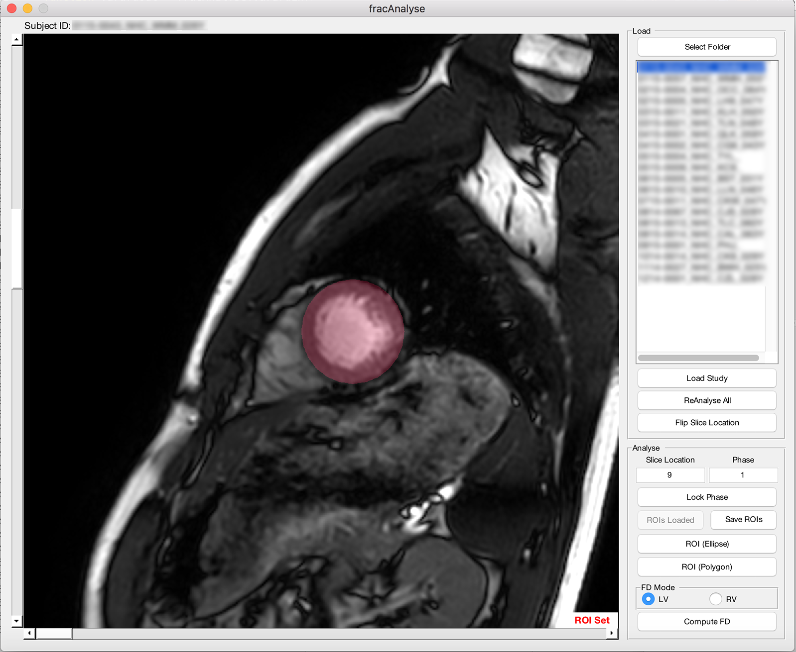

# fracAnalyse

Fractal analysis tool for computation of LV/RV fractal characteristics, using LVSA series from CMR. Supports DICOMs/NIFTIs.



## Getting Started

### Prerequisites

Current version is supported on Mac OS only, support for Windows is pending.

It is essential to set up MATLAB Compiler Runtime (MCR) 2016b prior to installation of fracAnalyse.
MATLAB Compiler Runtime (MCR): https://www.mathworks.com/products/compiler/mcr.html

### Installing

Download latest release from [Releases](https://github.com/caijiashen/fracAnalyse/releases)

## Fractal Analysis

### Loading Images

1. Click Select Folder and choose base folder containing DICOMs/NIFTIs of CMR studies

```
Base_Folder/Subj_xx/LVSA_Series/*.dcm
Base_Folder/Subj_xx/LVSA_Series/*.nii
```

2. Select study to be analysed from list and click Load Study

3. Selected study will be loaded and shown in main window, adjust image slice location as appropriate, with base of LV at Slice Location 1

### Defining Region of Interest (ROI)

ROIs can be defined using ellipse or polygonal tools

1. Click either ROI (Ellipse) or ROI (Polygon) as appropriate and adjust ROI such that it outside of LV endocardial border 


2. Double click to confirm ROI placement

3. Repeat for each slice as desired

### Fractal Dimension Computation

1. Click Compute FD, fractal analysis will proceed automatically

2. Images of thresholding, binary masks and computed FD values will be found in Base Folder

```
Base_Folder/ThresImg/Subj_xx/thresSlicexxPhasexx.png
Base_Folder/ThresImg/Subj_xx/binaryMaskSlicexxPhasexx.png
Base_Folder/FDSummary.csv
```

## Reference Ranges for Healthy Chinese

Reference ranges for LV trabeculation (fractal dimension; FD) and myocardial deformation (global myocardial strain) parameters can be found at [Reference Ranges](refranges/)

## Authors

* **Jiashen Cai ** - *Duke-NUS Medical School* - [caijiashen](https://github.com/caijiashen)
* **Pawel Tokarczuk ** -*LMS London Institute of Medical Sciences*
